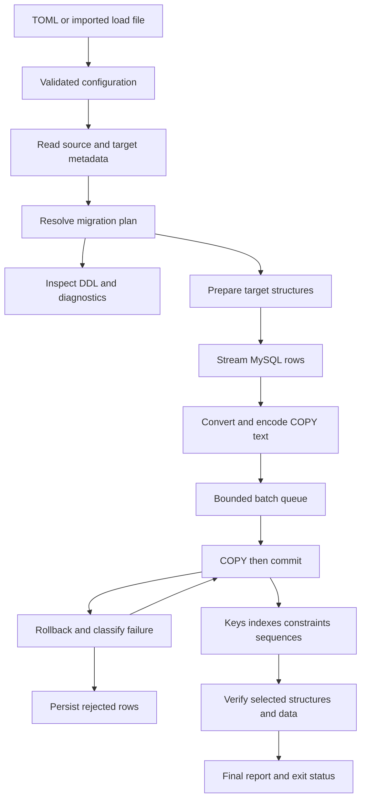

# Rust architecture

## Shape and module ownership

Start with one Cargo package containing `src/lib.rs` and `src/main.rs`. Split modules when they own distinct behavior, not merely to produce more files. Concrete MySQL/PostgreSQL implementations are sufficient; an extensible source trait would work against the product scope.

| Proposed module | Small interface | Owns |
| --- | --- | --- |
| `config/` | Parse and validate input into `MigrationConfig` | TOML, environment references, strict `.load` import, configuration diagnostics |
| `mysql/` | Inspect source and stream a selected table/range | Credentials/TLS, version capabilities, catalog SQL, raw values, session state, cursor lifecycle |
| `plan/` | Build `MigrationPlan` from config and catalogs | Stable source identity, selection, mappings, casts, target DDL, dependency checks, unsupported-object diagnostics |
| `convert/` | Encode a row under a resolved `ColumnPlan` | Exact types, transforms, COPY escaping, row limits; pure logic |
| `postgres/` | Inspect target, execute a DDL step, copy a batch | Qualified SQL, target sessions, explicit COPY finish/commit/rollback, database errors |
| `pipeline/` | Execute a plan and return `RunReport` | Scheduling, byte permits, row recovery, cancellation, committed accounting |
| `report/` | Render events and persist final artifacts | TTY/plain/JSON output, diagnostics, reject files, redaction |
| `verify/` | Compare requested structures and data | Counts, key/content checks, transformations, explicit coverage and mismatches |
| `main.rs` | Dispatch commands and map outcome to exit code | Process signals and command-line arguments |

Catalog queries live next to their owner in `.sql` files; generated DDL remains typed Rust logic. Tests call the same module interfaces as production. Use real disposable databases for driver and transaction semantics; small pure tests cover conversion and planning. Add an internal failure-injection seam only where a network fault cannot be reproduced reliably otherwise.

## Data flow

This diagram shows execution order, not a single transaction. `plan` stops at the inspectable plan. `run` rebuilds and validates the plan against live metadata before any target mutation.

## Contracts frozen before parallel implementation

The first integrator task defines these in code and small serialized fixtures:

- `MigrationConfig`: schema version, exactly one source/target, selection, policies, casts, limits, and reporting options. Secret references are separate from resolved credentials.
- `SourceCatalog`: original identifiers, columns in ordinal order, raw type/default metadata, engine/charset/collation, generated expressions, ordered key parts, FK endpoints/actions, checks, next auto-increment value, and unsupported objects.
- `TargetCatalog`: only the destination objects and dependencies needed for planning, with version and extension capabilities.
- `MigrationPlan`: immutable table/column plans, source-to-target identity map, ordered DDL phases, resolved transforms, expected verification, exclusions/overrides, and diagnostics. No live connections or raw passwords.
- `EncodedBatch`: one contiguous immutable byte buffer plus row offsets/locators and a held byte-budget permit. A recovery slice shares the buffer instead of copying it.
- `RunEvent`: versioned event kind, run/table/range identity, monotonic duration, counts, phase, sanitized diagnostic, and progress estimate quality.
- `RunReport`: per-object outcomes, committed/rejected/unresolved/indeterminate rows, failed steps, chosen consistency policy, transformations, exclusions, verification coverage, timings, and artifact paths.

Source identity must survive every rename. Do not reuse a destination column name in a MySQL SELECT. Maintain one explicit mapping for DDL, COPY, FKs, rejects, and verification.

## Driver and dependency decisions

Use `tokio`, `mysql_async`, and `tokio-postgres` as the starting choice. MySQL's Rust driver exposes streaming results; use raw `Row` values and fallible conversions rather than collecting a table. PostgreSQL's COPY sink must be finished explicitly before committing. These capabilities are documented by the respective projects, but their interaction with this workload still requires the M0 spike. [MySQL result interface](https://docs.rs/mysql_async/latest/mysql_async/struct.QueryResult.html), [PostgreSQL COPY sink](https://docs.rs/tokio-postgres/latest/tokio_postgres/struct.CopyInSink.html).

The spike must prove exact unsigned/decimal/temporal/binary values, zero dates before policy conversion, modern authentication, TLS certificate/hostname validation, streaming under backpressure, and cancellation without draining an entire result into memory. If this fails, record the failed case and evaluate another driver before freezing transport code.

Proposed supporting crates: `clap` for CLI parsing; `serde`, `toml`, and `serde_json` for contracts; `bytes` and stream utilities for buffers; `thiserror` for typed errors; `tracing` for diagnostics; `indicatif` for progress; `regex` and `encoding_rs` only for the specified matching/decoding features. Use standard-library terminal detection. Select a maintained TLS adapter compatible with both chosen drivers during the spike, with an explicit verification test; do not assume installing a TLS crate configures validation.

The integrator owns dependency versions, features, minimum Rust version, and `Cargo.lock`. Pin a tested toolchain at implementation time. Avoid an ORM, a SQL transpiler, a general task graph engine, a second async runtime, custom wire protocols, and binary COPY until measurements justify them. The PostgreSQL server remains responsible for executing SQL and validating constraints.

## Planning and target preparation

`check` validates local configuration. `plan` additionally reads both catalogs and privileges, calculates selections, conversions, DDL, name collisions, and omissions. Neither performs DDL, creates source views, executes hooks, or installs extensions. Planning cannot guarantee later permissions, resource availability, or freedom from concurrent DDL; state those limits in its output.

For `run`, perform complete preflight before the first mutation. Recheck the schema fingerprint and relevant target objects after acquiring a migration-scoped PostgreSQL advisory lock. The lock prevents overlapping cooperating my2pg runs; it does not stop other applications. The operator must keep destination objects exclusively available during a migration.

Default creation fails if a selected destination object already exists. A selected `recreate` policy uses qualified `DROP ... RESTRICT`, resolves dependencies inside the selected set, and fails on outside dependents. It never drops a whole schema or uses automatic `CASCADE`. `truncate` validates the selected FK closure and target compatibility. `append` is an explicit data-only operation and is never used as a recovery shortcut.

Create necessary schemas/types first, then tables. Use bounded transactions for DDL steps; a failure rolls back its step and blocks dependent work. Existing target constraints/triggers remain active in data-only mode. PostgreSQL SQL hooks are explicit operator-supplied code whose potential effects extend beyond generated SQL; show their files and digests in the plan.

## Source consistency

Offer two explicit policies:

| Policy | Reader behavior | Valid use |
| --- | --- | --- |
| `frozen` | Parallel tables/ranges allowed | Source is a static clone or all relevant writers and DDL are held for the entire read and verification window; this is an operator assertion recorded in the report |
| `single_snapshot` | One MySQL reader connection and one repeatable-read, read-only consistent transaction across all selected reads; a separate pre-opened control connection can terminate and observe that exact reader during shutdown | InnoDB tables only, one reader, no concurrent source DDL; the same source transaction must supply content verification or its source digests |

InnoDB repeatable reads share a snapshot **within one transaction**. The design inference is that separate worker connections must not be described as one coordinated snapshot. [MySQL consistent reads](https://dev.mysql.com/doc/refman/8.4/en/innodb-consistent-read.html).

MyISAM and other nontransactional tables require `frozen`. Reject contradictory concurrency settings for `single_snapshot`. Preflight opens a separate MySQL control session immediately after reader initialization and before catalog queries, so it can terminate a reader blocked during catalog inspection. `RESOURCE_ADMISSION` charges two source sockets for every SingleSnapshot preflight because the selected plan is not known yet. Data-bearing runs retain both the snapshot reader and control connection; schema-only and no-table plans release the control connection after preflight. The control session performs no migration reads; on cancellation or failure it issues `KILL CONNECTION` for the captured reader ID and waits for that ID to disappear under the shutdown deadline. Cancellation during MySQL driver initialization, or a source session-setup error before its ID is exposed, reports that server-side termination could not be confirmed. Do not acquire a global source read lock automatically. Do not infer a write freeze from row counts, low traffic, or a metadata timestamp. Source schema fingerprints detect some drift, not all concurrent data changes.

## Streaming and memory

1. Open a dedicated MySQL reader and PostgreSQL writer for each active pipeline, within global permits. Apply required session settings on **every** connection, including range readers and DDL workers.
2. Resolve casts before scanning. Convert each raw row directly into a reusable COPY-text buffer; keep row offsets for recovery. Never route large decimals through floats or binary through lossy Unicode strings.
3. Bound both row count and encoded bytes. Flush before adding a row that would exceed a batch. Enforce a maximum raw/encoded row size; report oversize rows explicitly.
4. Bound queue length and the total retained batch bytes across all tables. Account for queued, filling, sending, and retry-retained buffers. Release permits only when data is no longer needed.
5. Reserve enough budget for each admitted pipeline to make progress. An encoder holding raw-row memory must not deadlock waiting for space held by other producers. Test the minimum-budget case.

An approximate local bound is `active_pipelines × (queue_batches + 2) × batch_bytes`, plus row workspaces, offsets, metadata, and driver buffers. A global budget limits retained application data even when table/range parallelism increases. **It is not a hard process-RSS limit**: MySQL packet allocation, TLS, driver caches, and allocator overhead need measurement and configured packet/row limits. The M0 spike must establish behavior for oversized rows before any bounded-memory claim.

Begin with one reader per table. Add table concurrency before range concurrency. Range mode uses a single non-null integer PK; composite/text/missing keys fall back to a full streaming scan with a reported reason. Generate ranges lazily with checked wide arithmetic, preserve the final maximum value without `max + 1` overflow, bound the task queue, and avoid `OFFSET`. Sparse keys and skewed row sizes belong in the benchmark corpus.

## COPY transactions and recovery

Normal path: begin transaction → COPY buffer → explicitly finish COPY → commit → increment committed counters. Finishing COPY alone does not prove a durable commit.

On failure, classify it before retrying:

| Failure | Required behavior |
| --- | --- |
| Conversion/encoding error | Apply configured stop/reject policy with source row locator; persist original typed values for a reject |
| COPY initialization, permissions, missing table, malformed generated SQL | Fail the table/run; never bisect the dataset |
| Confirmed row-local data/constraint failure | Roll back first; in reject mode retry deterministic subranges, isolate rejected rows, commit good subranges |
| Confirmed transaction abort such as deadlock/serialization | Bounded retry with backoff on the same data; do not count rows twice |
| Network loss before commit outcome is known | Mark commit outcome indeterminate and stop; never replay the batch automatically |
| Source disconnect | Stop the scan; no transparent reconnect into a different snapshot |
| Reject/report disk write failure | Fail the run; do not claim rejected data was safely recorded |

Use SQLSTATE and execution stage for classification. Treat PostgreSQL COPY line context as an optional validated optimization, not the correctness mechanism. Start with bounded bisection when row isolation is safe. Unique/FK constraints can depend on other rows: schema/finalization errors do not become arbitrary row rejects, and the committed/rejected outcome must be deterministic for a fixed ordered input.

With `on_row_error = "stop"`, the first row error rolls back the failing batch and requests global cancellation. Earlier batches may already be committed. With `reject`, retain exact reject records, enforce the configured reject limit, and finish with a nonzero partial outcome even if the remaining rows load.

Server-side `COPY ... ON_ERROR ignore` addresses input conversion errors and discards rows. It does not replace the required portable recovery and reject-artifact contract. Use ordinary COPY across all supported PostgreSQL versions. [PostgreSQL COPY behavior](https://www.postgresql.org/docs/18/sql-copy.html).

## Finalization, cancellation, and restart

Bound index concurrency separately from copying. Build primary/unique keys and secondary indexes after a table's successful copy; dependent FKs wait for all required tables and keys. Validate checks/FKs, initialize sequences, then run permitted after-load hooks and verification. A failed required step yields failure even when every row copied.

Sequence next values must account for both loaded maxima and source AUTO_INCREMENT metadata, increment/offset, empty tables, and target range. Sequence operations are not evidence of whole-run rollback. Unsupported generation beyond signed sequence range requires an explicit policy.

On SIGINT/SIGTERM or worker failure, stop new work, close channels, cancel active database operations, roll back known active transactions, join worker tasks within a bounded shutdown period, and write a partial report. A reader error must wake a waiting writer; a writer error must wake a reader blocked on a full queue. A second interrupt may force exit, with completion/durability marked unknown.

v1 has **no automatic resume**. Reports are evidence, not exactly-once checkpoints. Rehearse again into a fresh destination or explicitly recreate the selected objects after examining partial results. Do not automatically clean up useful partial data. A future resume design needs stable source snapshots, deterministic ranges, target ownership, durable checkpoint/commit coordination, and separate tests.

## Verification contract

Always report schema completeness and row accounting. Counts alone are a basic check, not content equivalence. Optional content verification uses canonical typed values after approved transformations, deterministic key traversal for keyed tables, and duplicate-preserving multiset comparison for tables without keys. Use bounded storage or external sorting for large keyless datasets; do not collect them in RAM or rely on an XOR hash that cancels duplicates.

Compute source expectations in the migration snapshot, or compare against an unchanged frozen source. A later standalone scan of a changing source cannot certify the original run. Reports distinguish complete, sampled, skipped, unsupported, different, and execution-error verification. The first v1 content mode is complete scanning; sampling can wait.

In append mode, capture the target's initial row count and verify the exclusive destination's final count against that baseline plus committed rows. Comparing total target rows to source rows would be wrong. v1 rejects complete content verification for append into a nonempty table before writing; isolating the newly appended multiset needs a separate future contract. Empty-target append can use the ordinary full-content comparison. The report states this scope restriction rather than claiming equivalence for preexisting data.

The standalone `verify` command requires an explicit completed run directory and reuses its saved plan and row accounting. The report contains a digest of the plan and password-free fingerprints of both connection endpoints; verification rejects a different plan or endpoint before scanning. It performs a fresh read-only scan, so the operator must keep the source dataset unchanged since the run; no later process can reattach to the original MySQL snapshot. The run's integrated verification remains the evidence for that original snapshot. Append count verification is unsupported after the run because its initial target-count baseline is not persisted.
